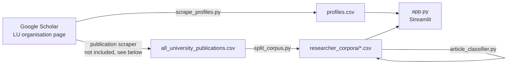

# LU Researchers Explorer

An interactive Streamlit app for exploring the publications of **Lebanese University (LU)** researchers on Google Scholar.

## Live Demo

Try the app here:

https://app-scholar-researchers-analysis-mzdjj2lprqo3qzpi9h3adr.streamlit.app/

The project collects researcher profiles and publications from Google Scholar, tags every article with a topic taken from the author's own research interests, and serves the result in a dashboard where you can:

- **Search researchers** and see their citations, h-index and paper count
- **Browse and filter articles** by researcher and topic
- **Find similar researchers** by comparing the topics of their publications
- **See a publication trend forecast** for a researcher or topic

## Pipeline



| Step | Script | Output |
|---|---|---|
| 1. Scrape profile metrics | `scrape_profiles.py` | `profiles.csv` |
| 2. Scrape publications | *(not included)* | `all_university_publications.csv` |
| 3. Split into one file per researcher | `split_corpus.py` | `researcher_corpora/*.csv` |
| 4. Tag each article with a topic | `article_classifier.py` | adds `Classified_Topic`, `Classification_Confidence` columns |
| 5. Explore | `app.py` | web app |

## Dataset: a frozen snapshot

The repository ships with the data already collected, so the app runs without any scraping:

| | |
|---|---|
| Researchers | 284 |
| Publications | 11,564 |
| Profiles with metrics | `profiles.csv` (283 rows) |
| Latest publication year | 2025 (partial year) |

**The publication scraper that produced `all_university_publications.csv` is not part of this repository.** Because of that, `researcher_corpora/` should be treated as a **frozen snapshot** of Google Scholar at collection time. `split_corpus.py` is kept to document how the per-researcher files were produced; it exits with a message if the raw export is missing.

Known data gaps in the snapshot:
- 19 researchers have no research interests listed on Google Scholar, so all their articles are `Unclassified`.
- A few profiles have missing metrics (shown as `N/A`), and one researcher has publications but no row in `profiles.csv`.
- Some rows have no description, so only the title is used for classification.

Profiles and publications are joined by **Google Scholar user ID** (from the profile / article URLs), not by name. This makes the join robust to names that were scraped with titles or punctuation (e.g. `Pr. Michel F. Khouri, Ph.D.`).

## How it works

### Topic classification (`article_classifier.py`)

This step is a transparent keyword heuristic, not a trained model. For each researcher:

1. Their Google Scholar *Research Interests* are split into candidate topics (on `, ; | & .` and separator hyphens, so `real-time` stays intact).
2. Each article's title + description is normalised (lowercase, punctuation removed; accented and Arabic letters are kept).
3. Each topic gets a score in [0, 1]:
   - **0.4 ×** Jaccard word overlap between article and topic
   - **0.4 ×** share of the topic's words (≥ 4 letters) that appear in the article, allowing variants such as *pharmacy / pharmacies*
   - **0.2 ×** 1 if the whole topic phrase appears in the article
4. The best topic scoring at least `0.05` is assigned; otherwise the article is `Unclassified`.

About 52% of articles receive a topic. An article can only receive a topic its author lists, so labels describe the article *relative to its author's declared interests*.

The script rewrites the `Classified_Topic` / `Classification_Confidence` columns in place and is idempotent: running it again produces the same result.

### Researcher similarity

A researcher × topic count matrix is built from **classified** articles only (`Unclassified` and missing labels are excluded). Researchers are compared with cosine similarity, and matches with zero shared topics are not shown. Because topics come from each researcher's own interests, similarity reflects shared, identically named interests (e.g. two researchers who both list *signal processing*).

### Publication forecast

Publications per year over the last 15 years are counted; years with no publications count as 0. A degree-2 polynomial regression is fitted and extrapolated 3–10 years ahead, with negative values clipped to 0. By default the snapshot's latest year (2025, which is incomplete for everyone) is excluded. In the chart, history is a solid line, the forecast is a dashed line, and a vertical rule marks the boundary. This is a simple trend illustration, not a statistical prediction.

## Getting started

Requires Python 3.10+.

```bash
git clone <repo-url>
cd google-scholar-researchers-analysis
python -m venv .venv
# Windows: .venv\Scripts\activate    macOS/Linux: source .venv/bin/activate
pip install -r requirements.txt

streamlit run app.py
```

The app opens at http://localhost:8501. Use the sidebar to:
- type an author name (each word matches the start of a name word, e.g. `haj hass` → *Fouad El Haj Hassan*)
- filter articles by topic
- pick a researcher to see the most similar researchers
- adjust or hide the publication forecast

### Re-running the pipeline

Re-classify the committed snapshot (≈30 s):

```bash
python article_classifier.py
```

Re-scrape profile metrics (needs Google Chrome; Selenium downloads a matching driver automatically). This overwrites `profiles.csv`:

```bash
python scrape_profiles.py
```

Rebuild `researcher_corpora/` from a raw export, only if you have a new `all_university_publications.csv`:

```bash
python split_corpus.py
```

## Project structure

```
├── app.py                   # Streamlit app
├── article_classifier.py    # topic tagging heuristic
├── scrape_profiles.py       # Selenium scraper for profile metrics
├── split_corpus.py          # splits the raw export into per-researcher files
├── profiles.csv             # profile metrics snapshot
├── researcher_corpora/      # one publications CSV per researcher (snapshot)
└── requirements.txt
```

## Limitations

- The dataset is a point-in-time snapshot and will drift from live Google Scholar data.
- Topic classification uses keyword matching. It misses articles that describe a topic in different words, and topic labels are not harmonised across researchers (*pharmacy* vs *pharmaceutical sciences* are different topics).
- The forecast extrapolates a quadratic trend. With few publications per year it is noisy and should be read as an illustration.

## Data and usage note

All data comes from publicly visible Google Scholar profiles. Automated access to Google Scholar is restricted by its terms of service. If you re-run the scraper, keep request rates low and use it for personal or research purposes only.
